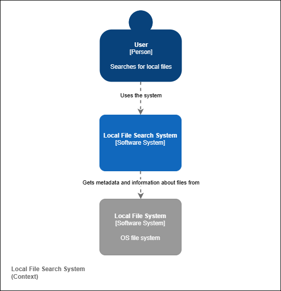
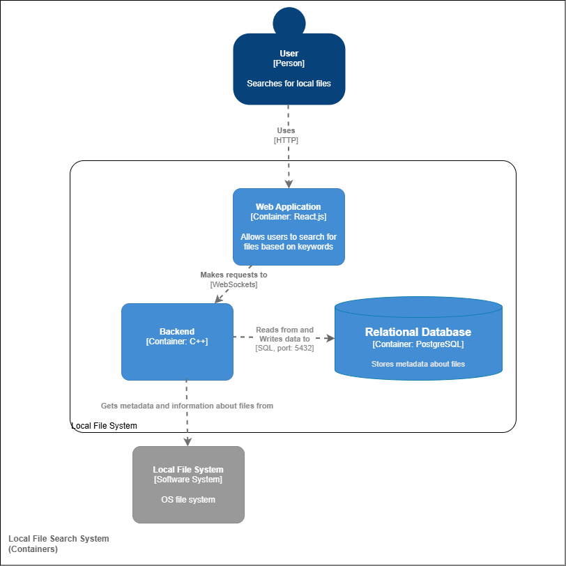
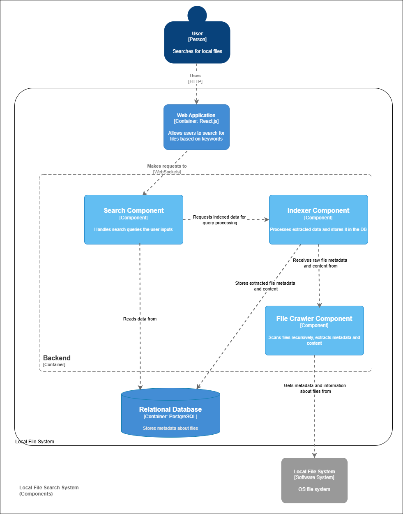

# Local File Search System Architecture

This project is a file search engine that indexes the local file system, allowing users to filter and search files in real-time based on their name, content, and metadata. The architecture follows the C4 model, providing system context, container, and component diagrams.

## System Context

The system allows users to search for local files through a web browser. It retrieves metadata and content from the local file system, indexes the information, and stores it in a relational database. When a user submits a query, the search engine processes it and returns relevant file information efficiently.

## Containers

The system is composed of several containers that handle different aspects of indexing, searching, and serving data.

The **Web Application** serves as the user interface, built with React.js. It allows users to enter search queries and view results in real time. It communicates with the backend via WebSockets to ensure fast interactions.

The **Backend** is developed in C++ for high performance. It is responsible for processing search queries, indexing files, and managing communication between the file system and the database. The backend ensures efficient data retrieval and indexing.

The **Relational Database** uses PostgreSQL to store file metadata and indexed content. It supports full-text search, allowing for quick and relevant query execution.

The **Local File System** is the source of all file metadata and content. The backend accesses it to extract data, which is then indexed and stored in the database.

## Components

Within the backend, there are several key components that manage different parts of the search process.

The **Search Component** processes user search queries, optimizes them for better performance, and retrieves relevant indexed data from the database.

The **Indexer Component** processes extracted metadata and content from files, ensuring that the database is kept up to date with accurate search information. It handles updates and deletions to maintain an efficient search experience.

The **File Crawler Component** scans files recursively within the local file system, extracting relevant metadata and file content. It forwards this information to the indexer component for processing and storage.

This architecture ensures a scalable and efficient local file search system with optimized indexing and retrieval mechanisms, providing users with fast and relevant search results.

